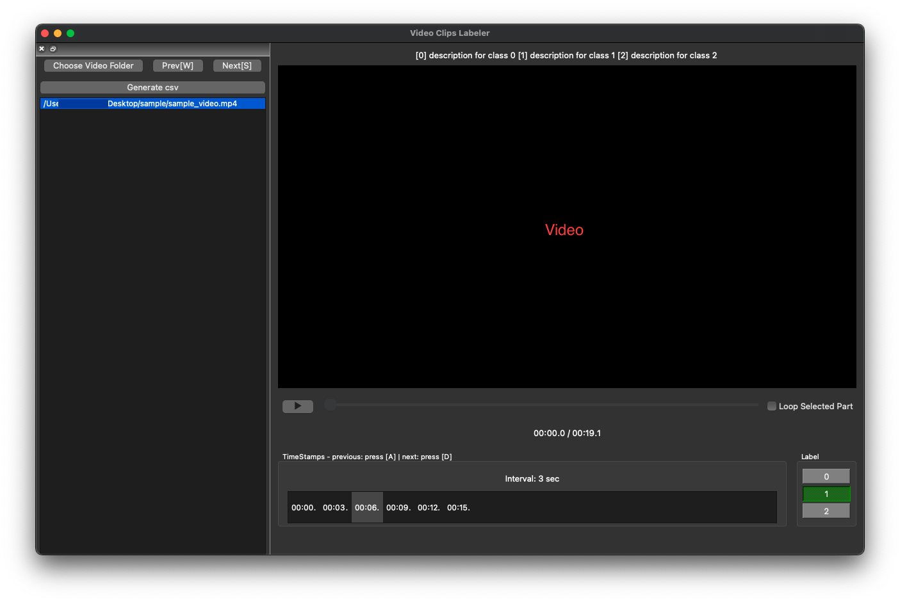

# Video Clips Labeler
__Video Clips Labeler__ is a PyQt GUI application for labeling split parts of a video.
<p align='center'>
    
</p>


### Main Features
* Creates timestamps of a video for a user defined value of interval (sec)

  _** Note that Video Clips Labeler does not actually split a video into parts **_

* Allows users to label video parts using push buttons
* Generates an output label file in csv
<br><br/>
### Keyboard Shortcuts
* W: select previous video
* S: select next video
* A: select previous timestamp
* D: select next timestamp
* num keys: choose the corresponding label (TBU)
<br><br/>

## Installation
---
__macOS__
    
> label_video_clips_mac.py


__Windows__ (TBU)

> label_video_clips_win.py 

→ install codecs for mp4 files in case of loading errors

→ or use avi files as inputs
<br><br/>

### Convert label_video_clips.py to APP/EXE using Pyinstaller
```
# example for mac users
pip install pyinstaller
pyinstaller --noconsole --onefile ./label_video_clips_mac.py
```